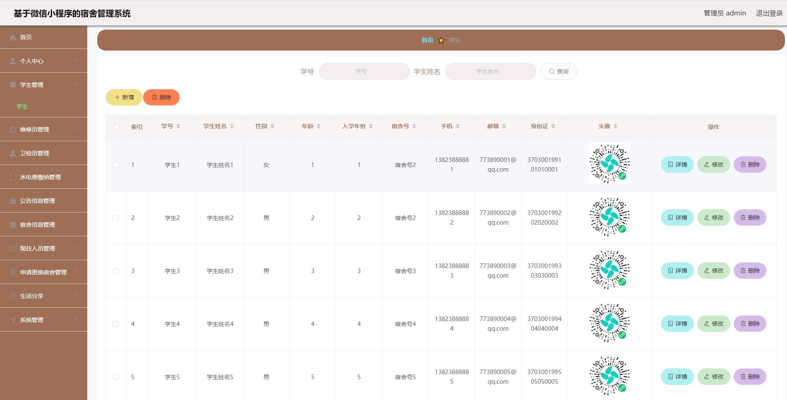
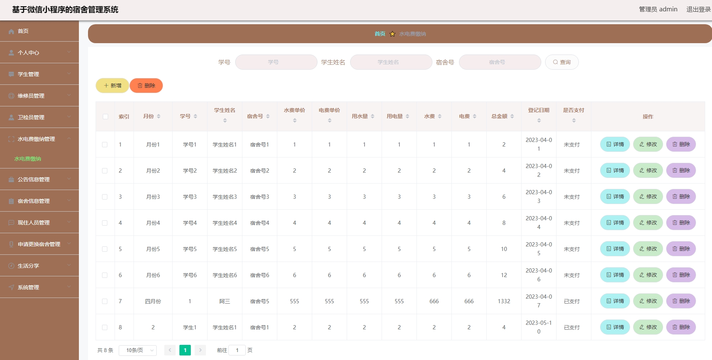
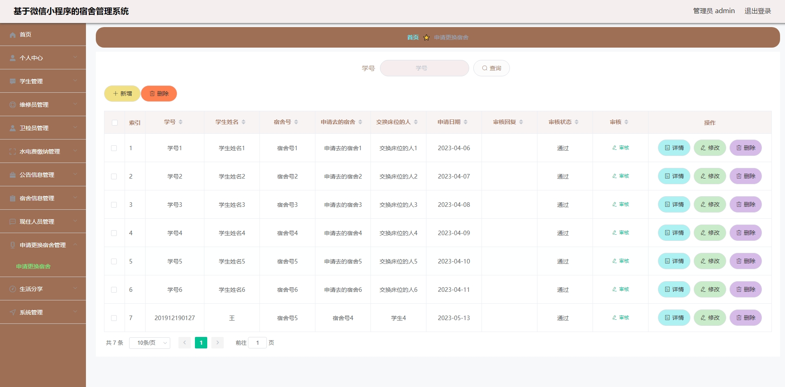
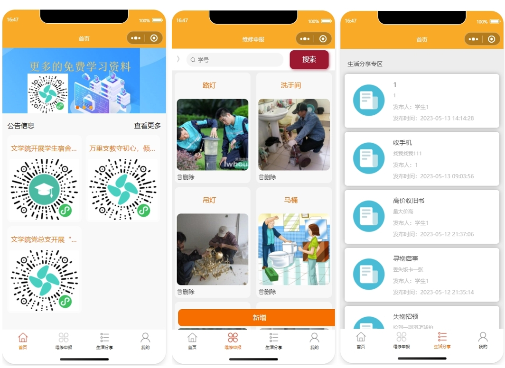
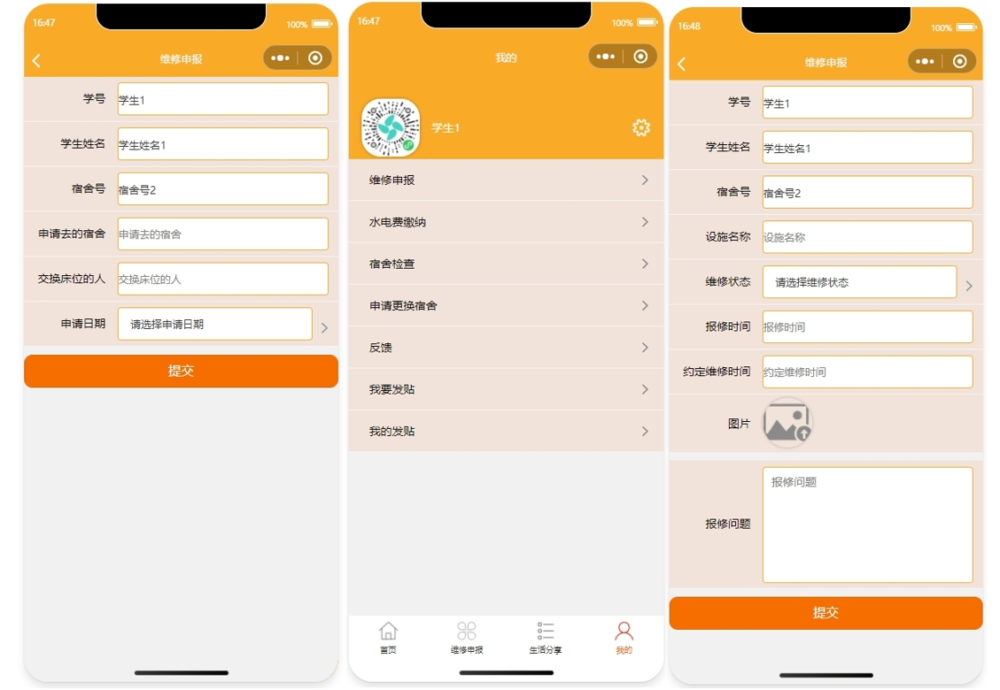
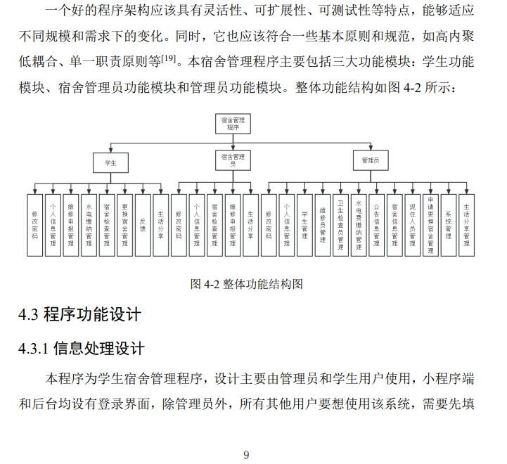
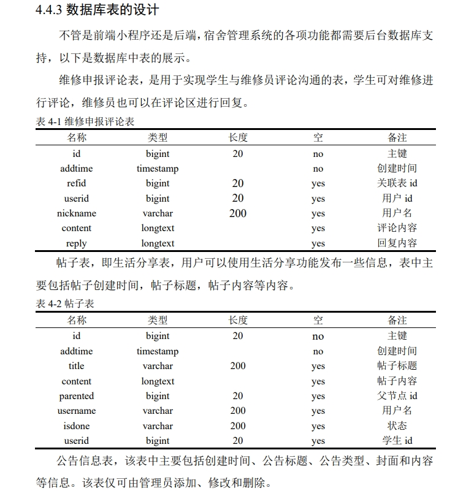
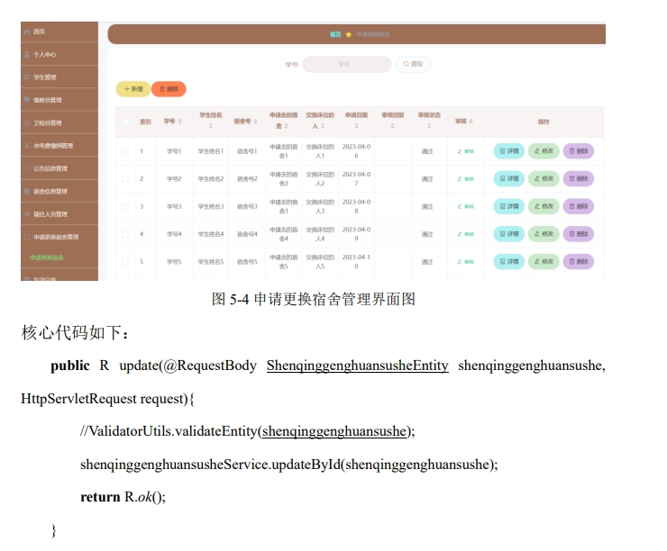
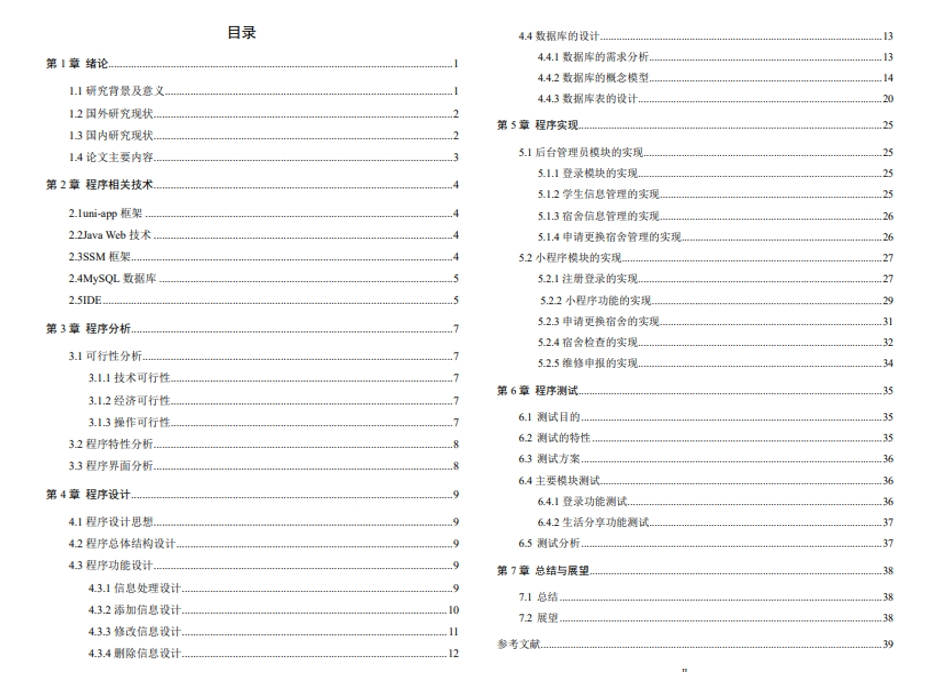
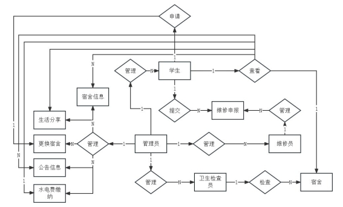

郑重声明：项目经本人本地测试，确保可以运行，项目仅供学习或毕业设计参考~
获取方式：[戳我查看](https://gitee.com/aven999/mall)💕
# 1.项目介绍
- 我的测试环境：IDEA2022，tomcat8.5，Mysql5.7，微信开发工具（调试基础库2.31.1）
 - 技术栈：SSM, uniapp，Vue（后端管理web提供的是dist包）
 - 角色：管理员，学生，维修员，卫检员
# 2.项目部署
项目部署很简单：
- 导入数据库(使用navicat或者其他工具，我的数据库编码是utf8mb4，排序默认）
- 按照你的数据库环境，修改代码
- 配置Tomcat，注意路径的配置
- 启动，后端web
- 将mp-weixin使用微信开发工具打开，appid选择测试号即可，运行即可~
# 3.部分系统截图

# 4.获取方式
获取方式：[戳我查看](https://gitee.com/aven999/mall)💕
